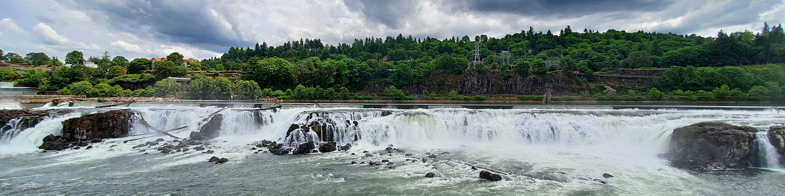
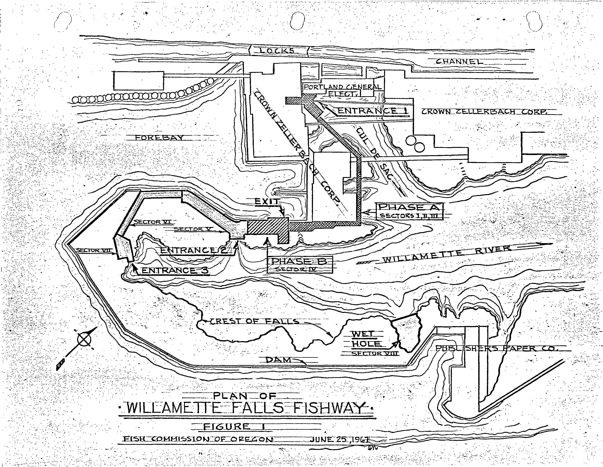

```{r setup, include=FALSE}
knitr::opts_chunk$set(echo = TRUE)
library(tidyverse)
library(here)
library(janitor)
library(dplyr)
library(lubridate)
library(tsibble)
library(feasts)
library(slider)
library(patchwork)

```

# Passage of salmon over Willamette Falls fish ladder (2001-2010)




## Overview

These data describe adult fish passage recorded from 2001-01-01 to 2010-12-31 at the Willamette Falls fish ladder on the Willamette River (Oregon). Data were shared by and accessed from Columbia River DART.




Citation: Data Courtesy of U.S. Army Corps of Engineers, NWD and Chelan, Douglas, and Grant County PUDs, Yakima Klickitat Fisheries Project, Colville Tribes Fish & Wildlife (OBMEP), Oregon Department of Fish & Wildlife, Washington Department of Fish & Wildlife.

## Report {.tabset}

### Original time series

```{r, message = FALSE}
# Read in data and clean names.

salmon <- read_csv(here("data", "willamette_fish_passage.csv")) %>% 
  clean_names() %>%  
  mutate(date = mdy(date))

salmon_subset <- salmon %>% 
  select(date, coho, jack_coho, steelhead) %>% 
  mutate(coho = replace_na(coho, 0)) %>% 
  mutate(jack_coho = replace_na(jack_coho, 0)) %>% 
  mutate(steelhead = replace_na(steelhead, 0))

# Define colors for different fish species

colors <- c("Coho" = "darkred", "Jack Coho" = "steelblue", "Steelhead" = "gray")

# Create line plot of three salmon species over time

ggplot(data = salmon_subset, aes(x=date))+
  geom_line(aes(y=coho, color = "Coho"), size = 0.5)+
  geom_line(aes(y=jack_coho, color = "Jack Coho"), size = 0.5)+
  geom_line(aes(y=steelhead, color = "Steelhead"), size = 0.5) +
  labs(x="Year",
       y = "Number of fish",
       title = "Number of fish crossing Willamette Falls Fishway, 2001 - 2010",
       color = "Legend")+
  theme_minimal()+
  scale_color_manual(values = colors)
  

```

There are strong seasonal cycles of fish crossing the Willamette Falls Fishway. Coho and Jack Coho tend to cross the fishway at different times from Steelhead. There is an increasing trend over time in the number of 
Coho.


### Seasonplots

```{r, message = FALSE}
# Create tsibble

salmon_subset_ts <- as_tsibble(salmon_subset)

steelhead <- salmon_subset_ts %>%
  filter(year(date) > 2001) %>%
  gg_season(y = steelhead, show.legend = FALSE) +
  labs(x = "Year",
       y = "Number of Steelhead")

coho <- salmon_subset_ts %>%
  filter(year(date) > 2001) %>%
  gg_season(y = coho, show.legend = FALSE)  +
  labs(x = element_blank(),
       y = "Number of Coho",
       title = "Figure 1. Number of salmon in Willamette Falls Fishway")

jack_coho <- salmon_subset_ts %>%
  filter(year(date) > 2001) %>%
  gg_season(y = jack_coho) +
  labs(x = element_blank(),
       y = "Number of Jack Coho")

# Use patchwork to create compound graph

salmon_graph <- coho / jack_coho / steelhead & theme_minimal()
salmon_graph
```

Steelhead salmon migrate up the Willamette Falls Fishway between February and July, wherease Coho and Jack Coho migrate up the fishway in October. The maximum number of Coho migrating per day is much greater (more than 1000) than the maximum number of Jack Coho (~300) or Steelhead (~600). The number of Coho migrating per day have increased greately over time since 2005.


### Annual counts by species


